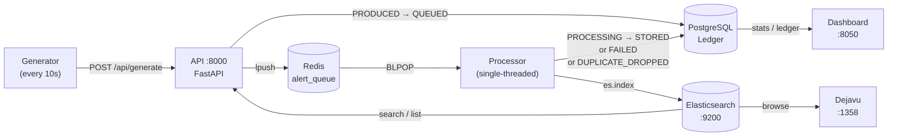
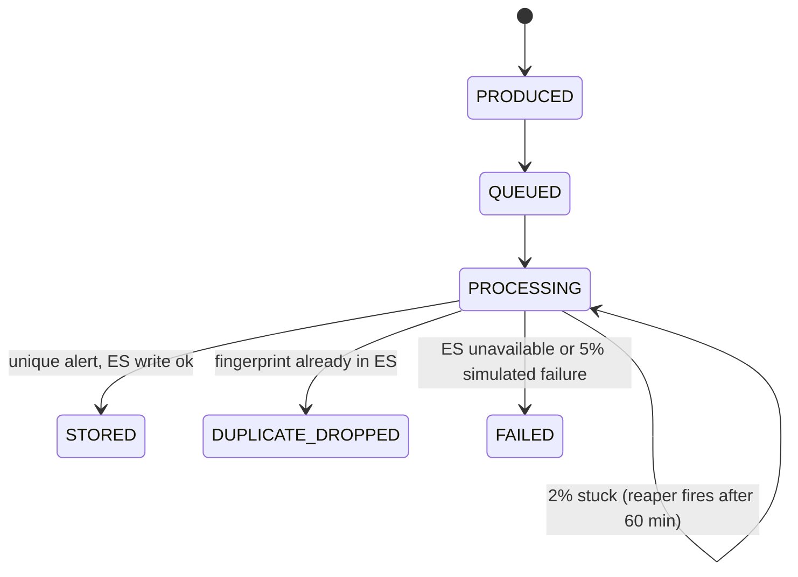
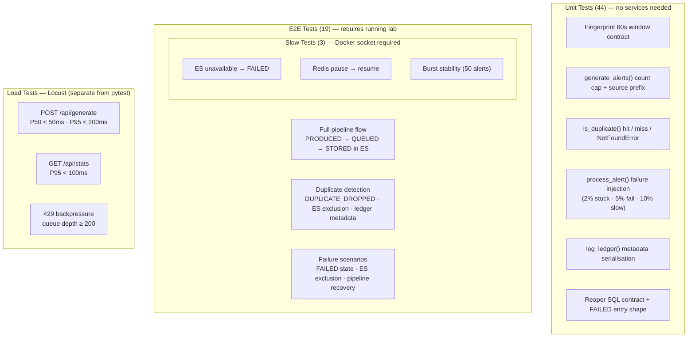

# Alert Pipeline Lab
> The code is AI-Assisted but design trade-offs are co-authored and reviewed before implementation. 
> This lab is intended for SDET technical assignment evaluation. 

A complete 8-service security alert processing pipeline built for SDET technical assignment. Demonstrates end-to-end alert generation, queuing, deduplication, storage, and observability — with a full test suite covering unit, E2E, and load testing.

---

## Quick Start

```bash
# 1. Register shared git hooks (one-time per clone)
git config core.hooksPath .githooks

# 2. Start the lab
docker compose -f services/docker-compose.yml --profile pipeline up --build -d
docker compose -f services/docker-compose.yml ps

# 3. Wait ~30s, then validate all 8 services
python services/validate_service.py

# 4. Run the test suite
python3 -m venv .venv
source .venv/bin/activate

pip install -r tests/requirements.txt
pytest tests/ -v
```

> The git hook prints a `/update-docs` reminder after any commit that touches `services/` or `tests/`.

---

## Architecture



### Alert State Machine



### Fingerprint Dedup Window

```
sha256(source_ip + alert_type + floor(unix_time / 60))[:16]
         └── same IP + type within 60s → same fingerprint → DUPLICATE_DROPPED
```

---

## Services

| Service | Port | Role |
|---------|------|------|
| redis | — | Alert queue (`alert_queue` list) |
| postgres | 5432 | State ledger — every lifecycle transition |
| elasticsearch | 9200 | Final alert store (searchable, keyword-indexed) |
| api | 8000 | FastAPI: alert factory, REST endpoints, schema owner |
| generator | — | Calls `POST /api/generate` every 10s, 10% duplicate rate |
| processor | — | Consumes Redis, deduplicates, writes to ES |
| dashboard | 8050 | Live pipeline stats, auto-refresh every 5s |
| dejavu | 1358 | Browser-based ES data explorer |

---

## Test Coverage



### Run Tests

```bash
# Unit only (no lab needed)
pytest tests/unit/ -v

# E2E (lab must be running)
pytest tests/e2e/ -v

# Full suite excluding load
pytest tests/ -v --ignore=tests/load

# Load test (headless)
cd tests/load && locust -f locustfile.py --headless -u 50 -r 5 -t 2m
```

See [tests/Tests.md](tests/Tests.md) for full setup, marker reference, and design tradeoffs.

---

## See Also

- [services/lab_setup.md](services/lab_setup.md) — full architecture, API reference, tradeoffs, known limitations
- [tests/Tests.md](tests/Tests.md) — test prerequisites, markers, load test, parallel execution guide
- [API docs](http://localhost:8000/docs) — auto-generated OpenAPI docs (when lab is running)
