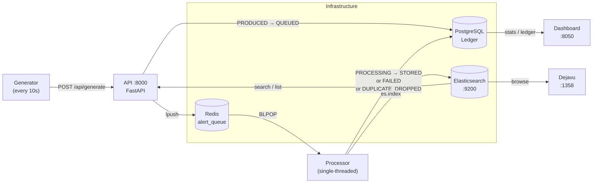
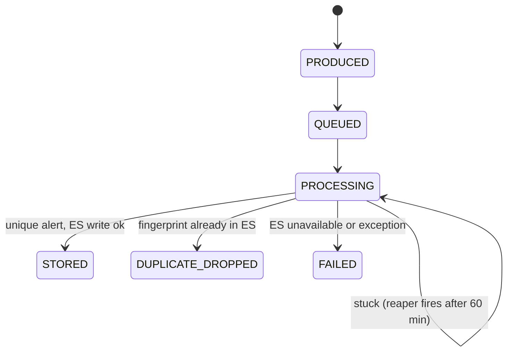
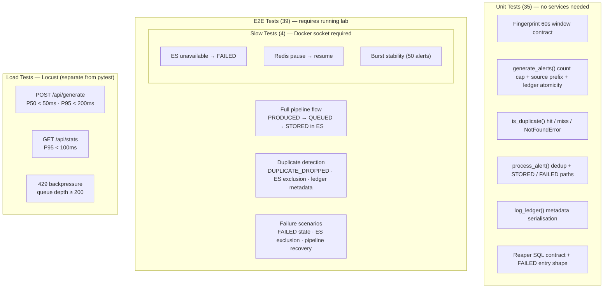

# Alert Pipeline Lab
> The code is AI-Assisted but design trade-offs are co-authored and reviewed before implementation. 
> This lab is intended for SDET technical assignment evaluation. 

A security alert processing pipeline with 4 Python services, backed by Redis, Postgres, and Elasticsearch. Built for SDET technical assignment.

---

## Quick Start

```bash
# 1. Register shared git hooks (one-time per clone)
git config core.hooksPath .githooks

# 2. Set up local Python 3.12 venv (one-time per clone)
./setup_venv.sh
source .venv/bin/activate

# 3. Start infra + dashboard, then pipeline services
cd services/
docker compose -p alertlab up -d
docker compose -p alertlab --profile pipeline up --build -d
docker compose -p alertlab ps

# 4. Wait ~30s, then validate the pipeline
python services/validate_service.py

# 5. Run the test suite
cd tests && pytest -m unit
```

> The git hook prints a `/update-docs` reminder after any commit that touches `services/` or `tests/`.

---

## Architecture



### Alert State Machine



### Fingerprint Dedup Window

```
sha256(source_ip + alert_type + floor(unix_time / 60))[:16]
         └── same IP + type within 60s → same fingerprint → DUPLICATE_DROPPED
```

---

## Services

**Pipeline services (Python):**

| Service | Port | Role |
|---------|------|------|
| api | 8000 | Alert factory, REST endpoints, schema owner |
| processor | — | Deduplicates alerts, writes to ES |
| generator | — | Calls `POST /api/generate` every 10s, 10% duplicate rate |

**Infrastructure (always-on):**

| Service | Port | Role |
|---------|------|------|
| dashboard | 8050 | Live pipeline stats, auto-refresh every 5s |
| redis | 6379 | Alert queue (`alert_queue` list) |
| postgres | 5432 | State ledger — every lifecycle transition |
| elasticsearch | 9200 | Final alert store (searchable, keyword-indexed) |
| dejavu | 1358 | Browser-based ES data explorer (optional) |

---

## Test Coverage



### Run Tests

```bash
# Unit only (no lab needed)
pytest tests/unit/ -v

# E2E (lab must be running)
pytest tests/e2e/ -v

# Full suite excluding load
pytest tests/ -v --ignore=tests/load

# Load test (headless)
cd tests/load && locust -f locustfile.py --headless -u 50 -r 5 -t 2m
```

See [tests/Tests.md](tests/Tests.md) for full setup, marker reference, and design tradeoffs.

---

## See Also

- [services/lab_setup.md](services/lab_setup.md) — full architecture, API reference, tradeoffs, known limitations
- [tests/Tests.md](tests/Tests.md) — test prerequisites, markers, load test, parallel execution guide
- [API docs](http://localhost:8000/docs) — auto-generated OpenAPI docs (when lab is running)
