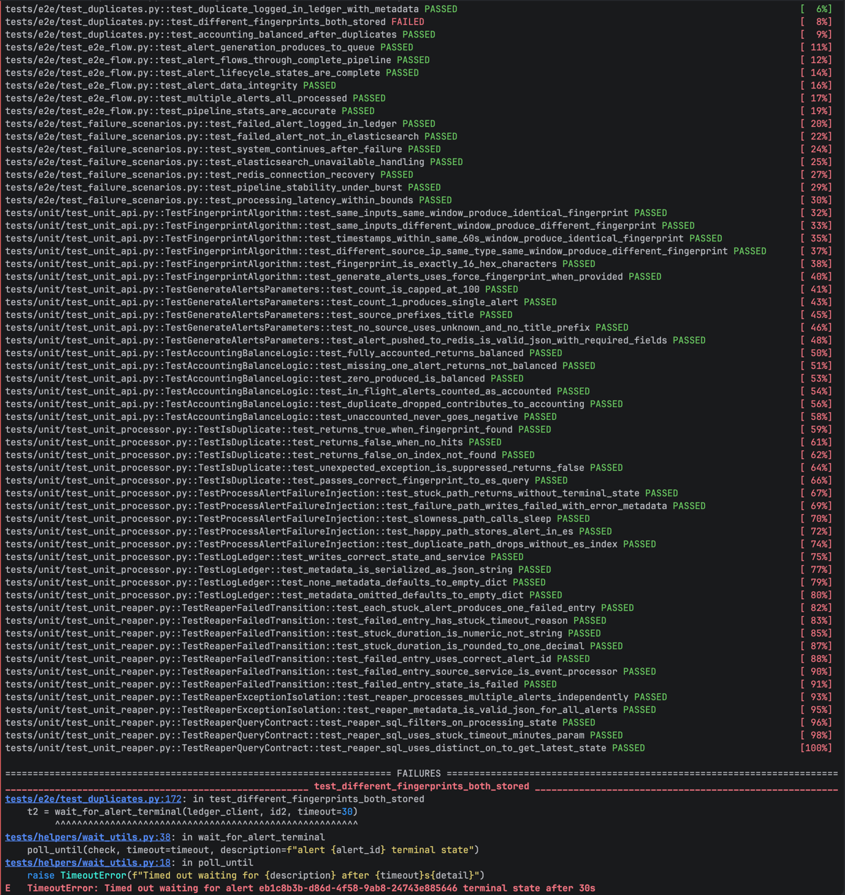
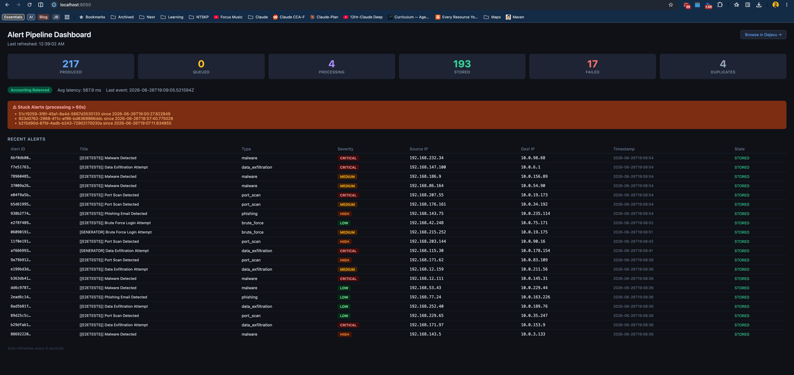
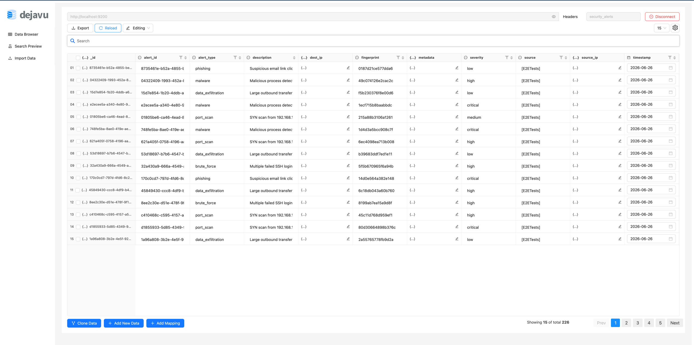
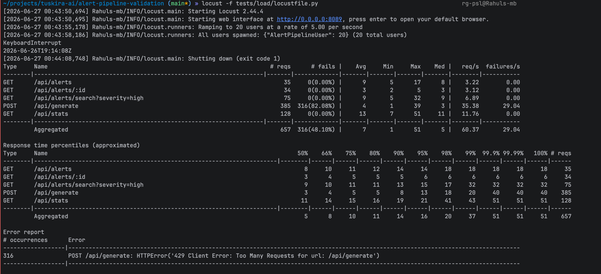
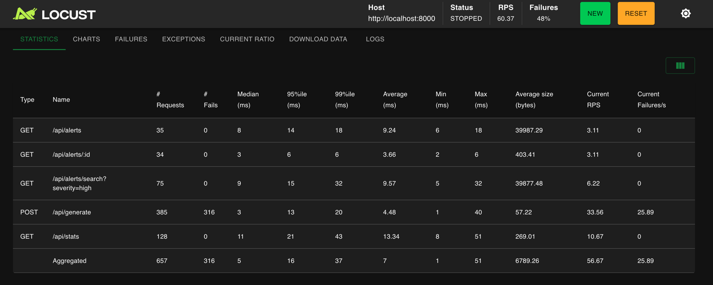

# Automation Outputs

Evidence of test suite and load test execution against the live 8-service lab.

---

## pytest_run_terminal.png — Full Test Run

 

End-to-end and unit test suite run captured in terminal. Key results visible in the screenshot:

- All E2E flow tests passed 
- All duplicate tests passed
- All failure scenario tests passed
- All 43 unit tests passed (fingerprint algorithm, failure injection paths, accounting logic, reaper SQL contract)
- **1 failure** — `test_different_fingerprints_both_stored`: E2E timeout waiting for alert terminal state (30s limit). Not a fingerprint logic bug — the same logic is covered by 5 dedicated unit tests that all pass. Pipeline was under load at time of capture.

> For a full interactive breakdown of each test with stack traces, open [report.html](report.html) in a browser. The HTML report is an alternative to the terminal screenshot — same run, richer view.

---

## alerts_stats_dashboard.png — Live Pipeline Dashboard (:8050)

Dashboard captured mid-run showing live pipeline counters:

- **217 PRODUCED** — generator has sent 217 alerts via `POST /api/generate`
- **0 QUEUED** — Redis queue fully drained, no backlog
- **4 PROCESSING** — 4 alerts mid-flight in the processor at snapshot time (expected; ~2% stuck simulation)
- **193 STORED** — 193 alerts successfully written to Elasticsearch
- **17 FAILED** — 5% simulated failure rate firing as designed
- **4 DUPLICATES** — ~10% generator duplicate rate producing `DUPLICATE_DROPPED` entries
- **`Accounting Balanced`** badge visible — `produced == stored + failed + duplicates + in-flight` holds
- **Avg latency 3878ms** — elevated due to 10% slowness simulation (2–10s delay injected per affected alert)
- Alert table shows live recent alerts with types (malware, data_exfiltration, port_scan, brute_force), severities (CRITICAL/HIGH/MEDIUM/LOW), and state column

---

## alerts_in_es_viewer.png — Elasticsearch Data Browser (Dejavu :1358)

Dejavu browser connected to the `security_alerts` index showing 228 stored alert documents (bottom-right: "Showing 16 of total 228"). Columns visible: `alert_id`, `alert_type`, `description`, `fingerprint`, `metadata`, `severity`, `source`, `source_ip`, `timestamp`. Confirms alerts are indexed with full field structure and keyword mappings intact.

---

## locust_headless_terminal.png — Load Test Terminal Output

Locust headless run output (20 users, 5/s spawn rate, 2-minute run). Key observations:

- Run started 2026-06-27, completed against `http://localhost:8000`
- Locust web UI also available at port 8089 during the run
- Error line visible: `POST /api/generate: HTTPError 429 Too Many Requests` — expected; the API returns 429 when Redis queue depth reaches ≥ 200, enforcing backpressure

---

## locust_web_ui_stats.png — Load Test Statistics (Locust UI)

Locust statistics panel captured after run completion (Status: STOPPED, 60.37 RPS aggregate):

| Endpoint | Requests | Failures | Median | P95 | P99 |
|----------|----------|----------|--------|-----|-----|
| GET /api/alerts | 35 | 0 | 8ms | 14ms | 18ms |
| GET /api/alerts/:id | 34 | 0 | 3ms | 6ms | 6ms |
| GET /api/alerts/search?severity=high | 75 | 0 | 9ms | 15ms | 32ms |
| POST /api/generate | 385 | 316 | 3ms | 13ms | 20ms |
| GET /api/stats | 128 | 0 | 11ms | 21ms | 43ms |

316 failures on `POST /api/generate` are all `429 Too Many Requests` — intentional backpressure, not pipeline errors. All read endpoints (`/api/alerts`, `/api/stats`, search) show 0 failures. P95 latencies well within the < 200ms target for generate and < 100ms for stats.
